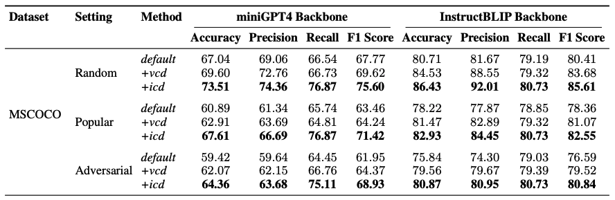
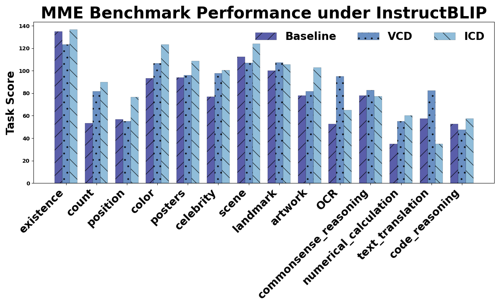

# ICD: Mitigating Hallucinations in Large Vision-Language Models with Instruction Contrastive Decoding

<!-- **ICD:Mitigating Hallucinations in Large Vision-Language Models with Instruction Contrastive Decoding** -->

Official implementation of [Mitigating Hallucinations in Large Vision-Language Models with Instruction Contrastive Decoding](https://arxiv.org/abs/2403.18715)

## :eyes: Overview


## :star: Setup

### Environment

```bash
conda create -n icd -y python=3.10
conda activate icd

# install dependency
pip install -r requirements.txt
```

**Note**: The dependencies are refered to [VCD](https://github.com/DAMO-NLP-SG/VCD/tree/master), [LLaVA](https://github.com/haotian-liu/LLaVA), [MiniGPT-4](https://github.com/Vision-CAIR/MiniGPT-4), [InstructBLIP](https://github.com/salesforce/LAVIS). You could also easily setup the environment by following the instructions from these repos.

### Datasets

Download images and annotations of the following datasets for the inference and evaluation.

- [COCO val2014 images and annotations](https://cocodataset.org/#download)
- [MME](https://github.com/BradyFU/Awesome-Multimodal-Large-Language-Models/tree/Evaluation)
- [GQA images](https://cs.stanford.edu/people/dorarad/gqa/download.html)
- [OK-VQA testing-images](https://okvqa.allenai.org/download.html)
- [llava-bench-in-the-wild](https://huggingface.co/datasets/liuhaotian/llava-bench-in-the-wild/tree/main)

Some annotations could be found in `experiments/data`.

## :pushpin: File Structure

After the inference, the generated results folder has the following structure:

```bash
results
  ├── mme
  └── pope
      └── ib
          ├── baseline
          └── icd
              ├── ow_format
              └── yn_format
                  ├── prompt1
                  └── prompt2
                      ├── normal.json
                      └── question.json
```

`_format` represents which question format is used for LLM generation. You could specify `yn_format`, `ow_format` and `no_format` by adding `--format .` after the running command.

Inside the prompt folders, there are two files: `normal.json` and `question.json`. The `question.json` file indicates that the question is integrated with the instructional disturbance in Q-former. The `normal.json` file used solely the instructional disturbance in Q-former.

## :joystick: Usage

### How to use ICD

To effectively demonstrate how ICD works, here is an example using InstructBLIP on ICD and highlighting some key contributions.

1. Replace `sampling` function by:

   ```python
   from icd_utils.icd_sample import evolve_icd_sampling
   evolve_icd_sampling()
   ```

   The `icd_sample` function replace the original `sampling` function in the transformers library. This mainly incorporates the constractive decoding method, where the constractive decoding occurs between the logits of the default model and the logits of the model with instructional disturbance, while keeping the rest unchanged.

2. Modify `experiments/lavis/models/blip2_models/blip2_vicuna_instruct.py`

   ```python
   if preprompt_cd is not None:
     text_Qformer_cd = self.tokenizer(
         preprompt_cd,
         padding='longest',
         truncation=True,
         max_length=self.max_txt_len,
         return_tensors="pt",
     ).to(image.device)
   # ....
   if use_cd:
     query_output_cd = self.Qformer.bert(
         text_Qformer_cd.input_ids,
         attention_mask=Qformer_atts_cd,
         query_embeds=query_tokens,
         encoder_hidden_states=image_embeds,
         encoder_attention_mask=image_atts,
         return_dict=True,
     )
   ```

   The Q-former in InstructBLIP can accept a textual instruction to extract instruction-aware visual features from the frozen image encoder ([InstructBLIP](https://arxiv.org/abs/2305.06500)). In ICD, the Q-former is given an instructional disturbance to lead the model extract vague and incomplete visual features. 

   This modification processes the given instructional disturbance (preprompt_cd) like the default model, then the outputs are sent toghether with the default outputs to the sampling function.

3. Generate the results

   ```python
   model.generate({"image": image, "prompt": question},preprompt_cd = preprompt,
                           use_nucleus_sampling=True, num_beams=1,
                           top_p = 1, repetition_penalty=1, cd_alpha=cd_alpha, 			
                  					cd_beta=cd_beta, use_cd=True)[0]
   ```

### Quick start

You could find all the inference and evaluation codes in `experiments/gen_scripts` and `experiments/eval_scripts` respectively. Here is an example using InstructBILP to inference and evaluation in various tasks.

**Inference**

```bash
# POPE
CUDA_VISIBLE_DEVICES=0 python icd_ib_pope.py --gvqa_image_root /path/to/gvqa_image_folder --coco_image_root /path/to/coco_image_folder --question_folder ../data/pope --save_folder ./pope/ib
# MME
CUDA_VISIBLE_DEVICES=0 python icd_ib_mme.py --data_path /path/to/MME_folder --save_folder ./mme/ib
# if use vcd + icd
CUDA_VISIBLE_DEVICES=0 python icd_ib_mme.py --data_path /path/to/MME_folder --save_folder ./mme/ib --vcd
# llava-bench
CUDA_VISIBLE_DEVICES=0 python icd_llava_bench_ib.py --question_file /path/to/question_file --image_root /path/to/images --save_folder ./llava_bench/ib
# Co-occurence
CUDA_VISIBLE_DEVICES=0 python icd_ib_co.py --gt_objects ../data/co_occur/gt_objects.json --image_root /path/to/coco_val2014 --save_folder ./co_occur/ib
# OK-VQA
CUDA_VISIBLE_DEVICES=0 python icd_ib_ok_vqa.py --question_file ../data/ok_vqa/OpenEnded_mscoco_val2014_questions.json --image_root /path/to/images --save_folder ./ok_vqa/ib
# Text-VQA
CUDA_VISIBLE_DEVICES=0 python icd_ib_text_vqa.py --question_file ../data/text_vqa/TextVQA_0.5.1_val.json --image_root /path/to/images --save_folder ./text_vqa/ib
# CHAIR (Please run experiments/data/chair/prepare_data.py first.)
CUDA_VISIBLE_DEVICES=0 python icd_ib_text_vqa.py --question_file ../data/chair/chair-val.jsonl --image_root /path/to/images --save_folder ./chair/ib
```

**Evaluation**

```bash
# POPE
python eval_pope.py --label_folder ../gen_scripts/data/pope --ans_folder ../gen_scripts/pope_results/ib/icd
# MME
python eval_mme.py --results_dir ../gen_scripts/mme/ib
# Co-occurence
python icd_ib_co.py --gt_objects ../data/co_occur/gt_objects.json --ans_folder ../gen_scripts/co_occur/ib/icd
# OK-VQA
python evaluate-ok_vqa.py --label_file ../data/ok_vqa/mscoco_val2014_annotations_enhanced.json --ans_folder ../gen_scripts/ok_vqa/ib/icd
# Text-VQA
python evaluate-text_vqa.py --label_file ../data/text_vqa/TextVQA_0.5.1_val.json --ans_folder ../gen_scripts/text_vqa/ib/icd
# CHAIR
python chair.py --cap_file ../path/to/file --coco_path /path/to/coco_val2014_annotations 
```

**Note**: 

1. The CHAIR question file and evaluation file refer to [yuezih/less-is-more](https://github.com/yuezih/less-is-more), please check the repo for more details
2. The arguments for each task are different and depend on the task requirements, some arguments should be set to your own path. Please check the details in `experiments/gen_scripts` and `experiments/eval_scripts`.

## :chart_with_upwards_trend: Experiments

- **The efficacy of ICD on POPE**

  

  Tabel 1(Part 1): The default under methods denotes the standard decoding, whereas VCD represents [Visual Contrastive Decoding [CVPR2024]](https://arxiv.org/abs/2311.16922), and ICD is our instruction contrastive decoding. The best performances within each setting are **bolded** 

- **The efficacy of ICD on MME**

  

  Figure3: : Performance on MME full benchmark on InstructBLIP.

- Please refer to [our paper](https://arxiv.org/abs/2403.18715) for more detailed experimental results.

## :memo: Citation

If you find our project useful, we hope you can star our repo and kindly cite:

```
@misc{wang2024mitigatinghallucinationslargevisionlanguage,
      title={Mitigating Hallucinations in Large Vision-Language Models with Instruction Contrastive Decoding}, 
      author={Xintong Wang and Jingheng Pan and Liang Ding and Chris Biemann},
      year={2024},
      eprint={2403.18715},
      archivePrefix={arXiv},
      primaryClass={cs.CV},
      url={https://arxiv.org/abs/2403.18715}, 
}
```

## :paperclip: Acknowledgement

This project is benefits from the following works:

- VCD: [Mitigating Object Hallucinations in Large Vision-Language Models through Visual Contrastive Decoding [CVPR2024]](https://arxiv.org/abs/2311.16922)
- LLaVA: [Visual Instruction Tuning [NeurIPS 2023]](https://arxiv.org/abs/2304.08485)
- MiniGPT-4: [MiniGPT-4: Enhancing Vision-Language Understanding with Advanced Large Language Models](https://arxiv.org/abs/2304.10592)
- InstructBLIP: [InstructBLIP: Towards General-purpose Vision-Language Models with Instruction Tuning [NeurIPS 2023]](https://arxiv.org/abs/2305.06500)
- Less is More: [Less is More: Mitigating Multimodal Hallucination from an EOS Decision Perspective [ACL 2024]](https://arxiv.org/abs/2402.14545)

Thanks for their awesome works.
